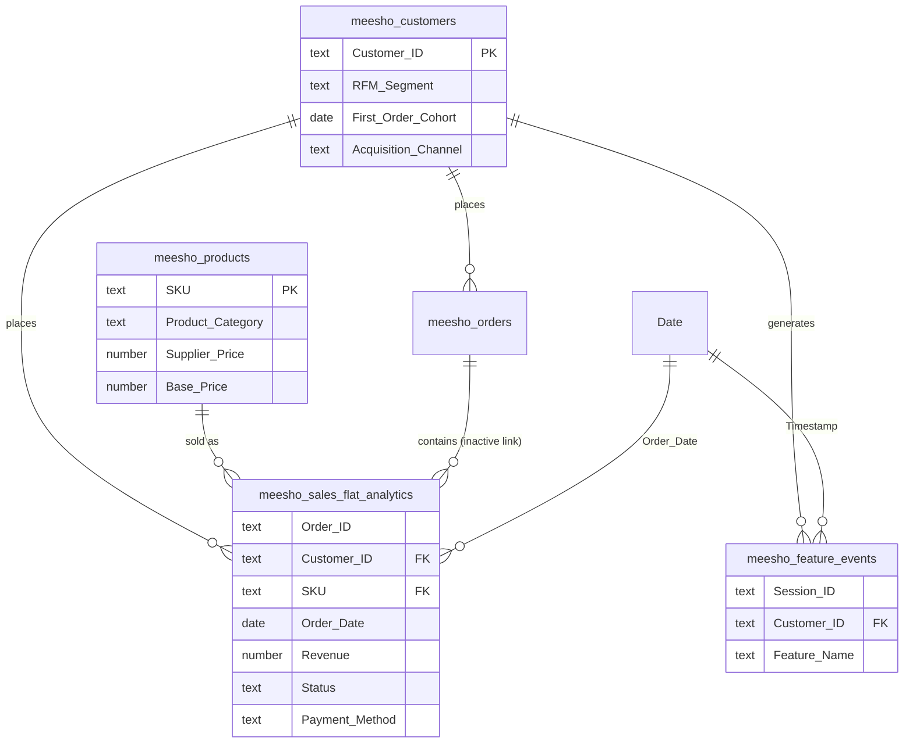

<div align="center">

# Customer 360° & Product Growth Intelligence Platform

**From raw marketplace events to board-ready decisions: SQL warehouse, Python analytics, a 7-page Power BI dashboard, a Natural Language analyst and a full product strategy for a Meesho-style social-commerce platform.**


</div>

---

## Executive Summary

India's social-commerce marketplaces grow on Tier-2/3 demand, but two leaks erode the growth: **parcels that come back undelivered (RTO)** and **shoppers who abandon at checkout**. This project builds an end-to-end analytics platform on **50,000 orders (70,032 line items), 10,000 customers and 500 SKUs** to quantify those leaks, segment the customer base, and turn the findings into a prioritised product plan.

- **Revenue gap:** Rs 42.29 Million gross revenue converts to only Rs 24.20 Million delivered (57.2%).
- **RTO:** 14.38% of gross revenue, Rs 6.08 Million, returns undelivered.
- **Funnel:** the biggest controllable drop is cart to checkout (42%), linked to late-appearing shipping fees.
- **Product answer:** *Smart-Confirm*, an automated WhatsApp COD verification and address-quality engine, targeting RTO of 11.0% within two quarters.

## Tech Stack

| Layer | Tools |
|---|---|
| Storage and modelling | SQL (SQLite), star-style analytical model |
| Cleaning and analytics | Python, Pandas, sqlite3 |
| Segmentation and cohorts | RFM scoring, monthly cohort retention |
| Business intelligence | Power BI, DAX (60+ measures, calculated columns, helper tables) |
| Product management | PRD, BRD, user stories (Gherkin), RICE prioritisation, roadmap |
| Quality | SQL reconciliation checks, DAX context audits, QA matrix |

## Key Platform Metrics & Impact Summary

| Metric | Value | Why it matters |
|---|---|---|
| Orders analysed | 50,000 (70,032 line items) | Full-year view, Jan 2025 to Jan 2026 |
| Customers / SKUs | 10,000 / 500 | Customer 360 and product analytics scope |
| Gross revenue | Rs 42.29 Million | All order statuses |
| Delivered revenue | Rs 24.20 Million (57.2% realised) | Cash actually collected |
| RTO rate | 14.38% (Rs 6.08 Million) | Largest operational leak |
| Funnel conversion | 100k search, 38k cart, 22k checkout, 10k order | 42% cart-to-checkout drop |
| Month-1 retention | About 33% (cohort cells 25% to 37%) | Repeat-purchase baseline |
| **Projected impact** | RTO 14.38% to 11.0%, protecting about Rs 1.45 Million; cart drop 42% to 32%, about +1,745 orders per 100k searches | Targets for the first two quarters |

> **Data note.** Projected figures rest on stated planning assumptions (for example Rs 100 freight per RTO order). The COD-share-of-RTO figure (68%) and the stated funnel counts should be re-derived from source data before publishing; see `docs/Phases_13-17_Documentation.docx` for the reconciliation notes.

## Data Architecture & Entity Relationship Summary



**Design notes:** `meesho_sales_flat_analytics` is the fact table at order-line grain. Order status values are `DELIVERED`, `SHIPPED`, `CANCELLED` and `RTO_COMPLETE`. The sales-to-orders relationship is inactive, so measures use fact-table fields to avoid ambiguity. A disconnected `Cohort Month` helper table drives the retention matrix.

## Key Modules Breakdown

### 1. Customer 360
RFM scoring (recency, frequency, monetary) places customers into segments such as Champions, Loyal Customers, At Risk, Cannot Lose Them, Hibernating and Lost. Includes CLV bands, churn status, inactivity bands and a VIP ranking. In the current data there are 1,916 Champions against 1,462 At Risk customers.

### 2. Revenue & RTO Analytics
Gross, delivered, shipped, cancelled and RTO revenue; net realised revenue (Rs 30.18 Million); leakage; COD vs Prepaid analysis; profit margin by category; regional RTO map and top-10 high-growth cities.

### 3. Growth Funnel
Stage-by-stage conversion from search to completed order, bounce rate, cart-add rate and drop-off percentages, built from session-level feature events.

### 4. Cohort Retention
Monthly cohort retention matrix with month index 0-12, pooled retention KPIs and cohort-aware DAX that excludes months not yet complete.

```dax
M1 Retention % =
CALCULATE (
    [Retention %],
    REMOVEFILTERS ( 'Cohort Month' ),
    'Cohort Month'[Month Index] = 1
)
```

### 5. AI Business Analyst Assistant
A command-line natural-language query engine (`ai_assistant/app.py`) over `meesho_growth_db`. Stakeholders ask in plain English and get a finding, business context and a recommendation.

```text
Ask> what is the RTO rate?
FINDINGS
  - RTO rate (RTO revenue / gross revenue): 14.38%
  - Revenue lost to RTO: Rs 6.08 Million
BUSINESS CONTEXT ...
RECOMMENDATION ...
```

## Product Strategy & PRD Highlights

**Feature: Smart-Confirm, Automated WhatsApp COD Verification & Address Hygiene Engine**

| Area | Detail |
|---|---|
| Problem | COD orders ship with no commitment or address check; COD drives 68% of RTO (about Rs 4.13 Million) |
| Core capabilities | WhatsApp verification bot, Address Quality Index (0-100), instant UPI incentive pop-up |
| Non-functional | Under 200 ms scoring latency; 99.9% WhatsApp API uptime with SMS fallback |
| Target outcome | RTO 14.38% to 11.0%; at least 70% of COD orders confirmed before dispatch |

**RICE prioritisation** (Reach x Impact x Confidence / Effort):

| Rank | Feature | RICE |
|---|---|---|
| 1 | WhatsApp COD Verification Bot | 4,080.0 |
| 2 | Pre-Checkout Pincode Delivery Estimate | 3,040.0 |
| 3 | One-Click Reordering for Repeat Buyers | 2,554.4 |
| 4 | Gamified Instant UPI Discount | 733.3 |
| 5 | Reseller Social Sharing Leaderboard | 250.0 |

**Roadmap:** Q1 address quality, WhatsApp bot and delivery estimate; Q2 UPI incentives, reorder and fee-transparency tests; Q3 reseller leaderboard and ML risk scoring.

## Repository File Layout

```text
customer-360-growth-intelligence/
├── README.md
├── LICENSE
├── requirements.txt
├── data/
│   ├── raw/                         # generated source CSVs
│   └── processed/                   # cleaned CSV exports
├── sql/
│   ├── 01_schema.sql                # tables, primary and foreign keys
│   ├── 02_load_data.sql
│   ├── 03_analytics_views.sql       # revenue, RTO, funnel views
│   └── 04_data_quality_checks.sql   # orphan, null and reconciliation checks
├── python/
│   ├── 01_generate_data.py
│   ├── 02_clean_data.py
│   ├── 03_rfm_segmentation.py
│   └── 04_cohort_retention.py
├── ai_assistant/
│   └── app.py                       # natural-language query engine
├── powerbi/
│   ├── meesho_ecomAI_analysis.pbix
│   └── dax_measures.md              # measure map
├── docs/
│   ├── Phases_13-17_Documentation.docx   # decisions, BRD, PRD, RICE, roadmap, QA
│   └── screenshots/                 # dashboard page images
└── tests/
    └── test_assistant.py
```

> Rename files to match your actual repository; the structure above is the recommended layout.

## How to Run

### 1. SQL warehouse
```bash
git clone https://github.com/<your-username>/customer-360-growth-intelligence.git
cd customer-360-growth-intelligence

sqlite3 meesho_growth_db.sqlite < sql/01_schema.sql
sqlite3 meesho_growth_db.sqlite < sql/02_load_data.sql
sqlite3 meesho_growth_db.sqlite < sql/03_analytics_views.sql
sqlite3 meesho_growth_db.sqlite < sql/04_data_quality_checks.sql   # expect zero orphan rows
```

### 2. Python environment
```bash
python -m venv .venv
source .venv/bin/activate            # Windows: .venv\Scripts\activate
pip install pandas

python python/02_clean_data.py
python python/03_rfm_segmentation.py
python python/04_cohort_retention.py
```

### 3. AI Business Analyst
```bash
python ai_assistant/app.py --db meesho_growth_db.sqlite      # interactive
python ai_assistant/app.py -q "What is the cart abandonment rate?"
python ai_assistant/app.py --selftest                        # runs every intent
```
If no database is found the assistant falls back to CSV files in `./data`, then to the documented baseline, and labels each answer's basis.

### 4. Power BI dashboard
1. Install [Power BI Desktop](https://powerbi.microsoft.com/desktop/).
2. Open `powerbi/meesho_ecomAI_analysis.pbix`.
3. If prompted, point the data source to your processed CSV folder or SQLite file and choose **Refresh**.
4. Explore the seven pages: Sales Overview, Customer 360, Revenue Intelligence, Product, Growth, Churn & Retention, Strategic Recommendations.

---

<div align="center">

**Built by Shardul** · Data analytics portfolio project

</div>
